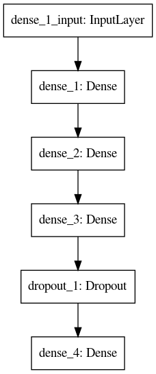

# lit-iris

Using streamlit to change hyperparamets and visualize results of a MLPClassifier used on the Iris Dataset. In less than 300 lines of code I was able to:

1. Acquire the data;
2. Transform the data (to_categorical from keras);
3. Prepare the MLPClassifier to be recompiled and trained each time the hyperparameters are changed;
4. Draw 4 plots about the training process and it's metrics;
5. Put all of that in a beautiful app, thanks to Streamlit.

## MLP

The MLP used in this project it has the architecture below. Note that the hyperparameters can be change inside the app.



## Streamlit

"Streamlit is an open-source app framework for Machine Learning and Data Science teams. Create beautiful data apps in hours, not weeks. All in pure Python. All for free." - Streamlit page

> [Streamlit](https://www.streamlit.io/)

## Requirements

With the code I've provided an enviroment file that you can use with conda to create your environment and run the project.

```python
$ conda env create -f environment.yml
$ conda activate lit-iris
$ streamlit run app.py
```