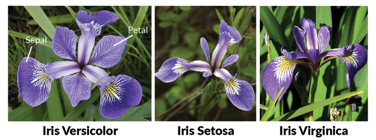

# Streamlit and Iris
___

Using streamlit to change hyperparamets and visualize results of a MLPClassifier used on the Iris Dataset.

## Streamlit

Streamlit is a data-viz tool, it's easy to use and code. It shine when we need to create a quick beatiful front-end for our models.

>> [Streamlit site](https://www.streamlit.io/)

## Requirements

